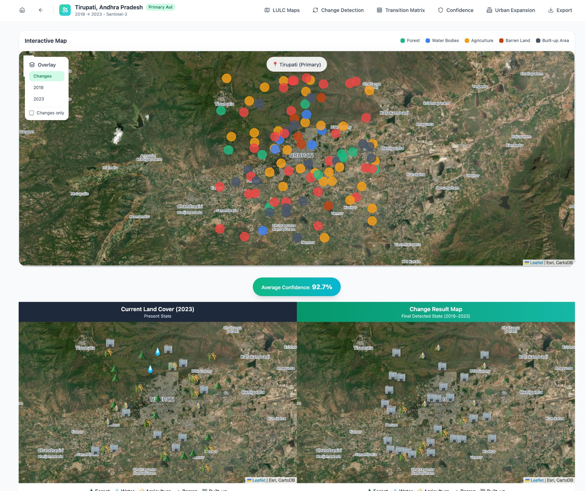
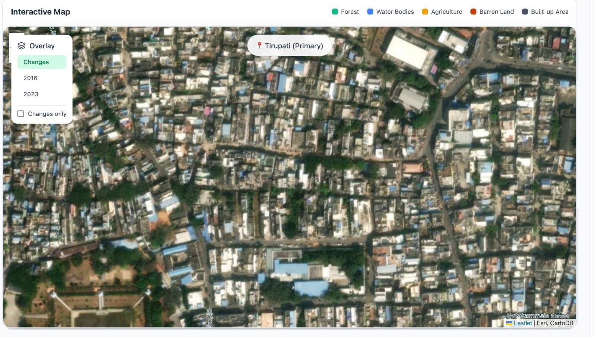

# AI-Based Pixel-Level LULC Change Detection for Tirupati

## Problem
Rapid urban expansion in Tirupati driven by pilgrimage, tourism, and infrastructure growth
is transforming land use and land cover. Manual monitoring is slow and ineffective,
creating a need for automated, pixel-level change detection to support sustainable
urban planning and smart city governance.

## Solution
This project proposes an AI-powered GeoSpatial framework that uses multi-temporal
satellite imagery to perform pixel-wise Land Use–Land Cover (LULC) classification
and detect land transitions over time with confidence estimation.
## PPT link
<a href="https://gamma.app/docs/TITLE-IdeaSprint-National-Innovation-Challenge-njnv5yo6lqwk3nh?mode=doc">Visit PPT</a>

## MVP (Minimum Viable Product)
- Pixel-level LULC classification for two time periods
- Detection of land-use transitions (e.g., Forest → Built-up)
- 5-class LULC transition matrix with area statistics
- Basic visualization of LULC maps and change overlays

## LULC Classes
- Forest
- Water Bodies
- Agriculture
- Barren Land
- Built-up

## Tech Stack

### Frontend
- React 18
- Tailwind CSS
- Framer Motion
- React Router 
- Lucide React
- Leaflet.js
### Backend
- Managed cloud backend
- Data management & processing logic
- Export workflows

## Data Sources
- Tirupati District Boundary (.shp)
- Landsat (USGS Earth Explorer)
- Sentinel-1 & Sentinel-2 (Copernicus Open Access Hub)

## Key Outputs
- Pixel-level LULC maps (multi-temporal)
- Change detection maps
- Transition matrix with area and percentage statistics
- Confidence and probability estimates for land transitions

## Impact
- Enables data-driven urban planning decisions
- Helps monitor urban expansion and vegetation loss
- Supports sustainable development and smart city governance

## Scalability
The framework is replicable and can be deployed across other districts and states
for large-scale environmental monitoring.

## Pixel area is shown clearly with Maps

## Pixel area is shown clearly with real images

## Transition matrix

